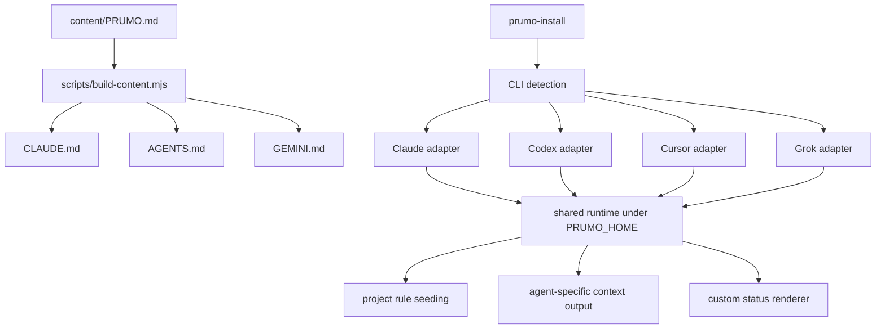

# Prumo — one operating protocol for coding agents

Prumo keeps coding agents on a verifiable delivery process across Claude Code, Codex CLI, Cursor, and Grok Build. One normative source generates the instruction files each tool reads; the installer adds only the lifecycle and status-line integrations each vendor documents.

A plumb line tells a builder whether a wall is straight. Prumo does the same for agent work: the model keeps its speed, while citable `PRU-xx` rules keep the delivery on the line.

## The problem

Agent instruction filenames and lifecycle contracts differ by vendor. Copying the same rules by hand creates drift, while context compaction can drop the compact reminders that keep a long session disciplined.

Prumo maintains one source, renders the required filenames, installs persistent rules where the CLI supports them, and uses lifecycle hooks to seed missing project instructions without overwriting files already there.

## Install

Requires Node.js 18 or newer. The npm package has not had its first public release yet. Until Slate and Prumo are on npm, clone both repositories as siblings:

```bash
git clone https://github.com/AnThophicous/Slate.git
git clone https://github.com/AnThophicous/Prumo.git
cd Slate
npm install
npm run build --workspaces --if-present
cd ../Prumo
npm install
node packages/installer/bin/prumo-install.mjs
```

After `@prumocode/install` is published, the equivalent command will be:

```bash
npx @prumocode/install
```

The Slate interface detects local agents and starts with the detected targets selected. Arrow keys move, space toggles, a mouse click toggles, enter installs, and `q`, escape, or `Ctrl+C` exits.

For scripts and CI:

```bash
node packages/installer/bin/prumo-install.mjs --all
node packages/installer/bin/prumo-install.mjs --only claude
node packages/installer/bin/prumo-install.mjs --dry-run --all
node packages/installer/bin/prumo-install.mjs --list
```

## What it installs

| CLI | Protocol persistence | Project file | Status line |
| --- | --- | --- | --- |
| Claude Code | `SessionStart` hook, including the `compact` source | `CLAUDE.md` | custom `Workstate: [Prumo] \| model \| project` |
| Codex CLI | `SessionStart` hook with `features.hooks = true`; it runs again after compaction | `AGENTS.md` | documented native items in `tui.status_line` |
| Cursor CLI and app | `sessionStart` hook plus an always-on user rule | `AGENTS.md` | unchanged; no documented custom command |
| Grok Build | global rule plus `SessionStart` and `PostCompact` seeding hooks | `AGENTS.md` | custom command in `[ui.status_line]` |

The integrations follow the current vendor contracts: [Claude Code hooks](https://code.claude.com/docs/en/hooks) and [status line](https://code.claude.com/docs/en/statusline), [Codex hooks](https://learn.chatgpt.com/docs/hooks) and [configuration](https://learn.chatgpt.com/docs/config-file/config-reference), [Cursor hooks](https://cursor.com/docs/hooks), and Grok Build [rules](https://docs.x.ai/build/features/project-rules), [hooks](https://docs.x.ai/build/features/hooks), and [status line](https://docs.x.ai/build/features/status-line).

Before changing an existing configuration file, Prumo writes one `<file>.prumo-backup` beside it. Reinstalling does not duplicate Claude, Codex, or Cursor hooks. Invalid existing JSON stops that step and leaves the original untouched.

## What the protocol says

The protocol contains 166 citable rules. Its load-bearing sections are:

- **Density per round** (`PRU-10` to `PRU-17`): write code, tests, and diagnostic output together; after three non-converging runs, rebuild the hypothesis.
- **Specification before code** (`PRU-50` to `PRU-54`): state the goal, scope, exclusions, assumptions, and executable acceptance criteria.
- **Readable code** (`PRU-20` to `PRU-28`, `PRU-160` to `PRU-182`): no dead code or hidden placeholders; names carry the explanation.
- **Git discipline** (`PRU-90` to `PRU-99`): inspect the staged diff, sweep for secrets, keep commits atomic, and never push without an explicit request.
- **Self-audit and security** (`PRU-110` to `PRU-115`, `PRU-210` to `PRU-239`): record concrete suspicions and close high-severity findings before delivery.

Read the normative text in [`content/PRUMO.md`](content/PRUMO.md).

## Configuration

| Option or variable | Default | Effect |
| --- | --- | --- |
| `--all` | off | Select every detected agent in headless mode |
| `--only <id>` | none | Install one of `claude`, `codex`, `cursor`, or `grok` |
| `--dry-run` | off | Print every target path without writing |
| `--no-statusline` | status lines enabled | Skip every supported status-line change |
| `--user-protocol` | off | Also copy the conventional protocol file into the agent home |
| `--list` | off | Print detection evidence and exit |
| `PRUMO_HOME` | `~/.prumo` | Set the shared runtime directory |
| `PRUMO_SEED=0` | seeding enabled | Stop hooks from creating project instruction files |
| `NO_COLOR` | unset | Render custom status lines without ANSI color |

Unknown options, unknown agent ids, and conflicting `--all`/`--only` selections fail before any file is touched.

## Architecture



The shared hook reads bounded JSON from standard input, resolves the workspace fields used by each CLI, and creates an instruction file only when none exists. Claude receives `hookSpecificOutput.additionalContext`, Cursor receives `additional_context`, Codex receives plain text, and Grok's passive hook stays silent because Grok ignores stdout for passive events.

## Known limitations

- Slate 2.3.0 is not published to npm yet. The Prumo tarball declares portable version dependencies, but public installation must wait for the two Slate packages to be released.
- Codex accepts named native footer items, not a custom command, so its status line cannot display the Prumo badge.
- Cursor documents no custom status-line command. Prumo leaves its footer unchanged.
- Grok documents command status lines on macOS and Linux; its documentation marks Windows support as untested. Prumo emits a Windows-safe Node command, but the CLI remains the compatibility boundary.
- A seed never overwrites an existing `CLAUDE.md` or `AGENTS.md`. Merge the protocol manually when a project already owns that file.

## Development

```bash
npm install
npm run content:build
npm test
npm run install:dry
npm pack --dry-run --workspace @prumo/install
```

The installer uses [Slate](https://github.com/AnThophicous/Slate) for flex layout, reactive state, hit-tested mouse input, and ANSI rendering. The test suite covers generated content, detection, configuration preservation, all four adapters, hook payloads, status-line output, keyboard input, mouse input, and argument validation.

## License

MIT. See [LICENSE](LICENSE).
