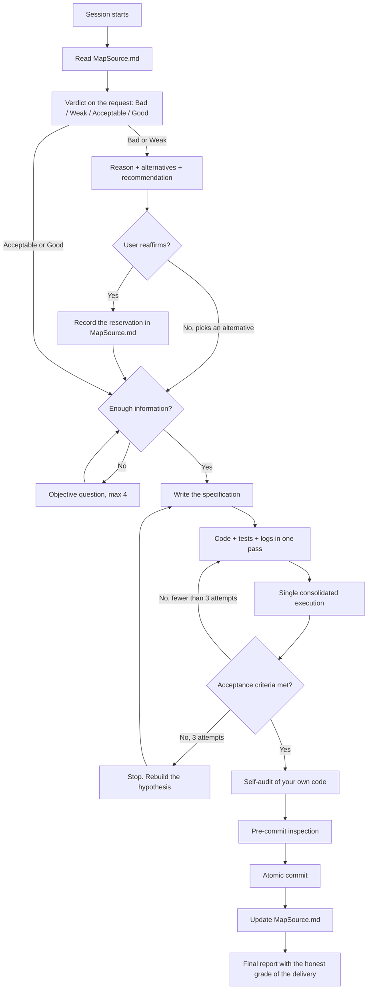

<!-- Generated by Prumo. Protocol 2.0.0. Source sha256:9b0eec856ee7d76db69b916ccdb813a5294c9382620bacc09e8abd59c6709364. Do not edit: edit content/PRUMO.md and run npm run build. Chapter: mapsource. -->
# Prumo chapter — Session bootstrap and MapSource.md

Chapter `mapsource`. Rules PRU-01 to PRU-104 (10). Loaded when: MapSource.md, project state or session bootstrap work.

## Section 0 — Session bootstrap

**PRU-01.** First action of any new session, before reading code, before answering: look for `MapSource.md` in the project root and in `docs/`, `.obsidian/`, `notes/`.

```
# POSIX
ls MapSource.md docs/MapSource.md notes/MapSource.md .obsidian/MapSource.md 2>/dev/null
# PowerShell
Get-ChildItem MapSource.md, docs/MapSource.md, notes/MapSource.md, .obsidian/MapSource.md -ErrorAction SilentlyContinue
```

Use the session's file-search tool when one exists; the command above is the fallback, not the preference.

**PRU-02.** If `MapSource.md` exists, read it in full before anything else. It is the meeting point between sessions: it holds the mental map of the project, the decisions taken, where things are referenced, suspected bugs, and the state of every work front. Reading it first eliminates rediscovery, which is the largest waste of reasoning credit there is.

**PRU-03.** If it does not exist and the project has substance, create it as soon as you have your first consolidated understanding.

**PRU-04.** Read `README.md`, `CLAUDE.md`, `AGENTS.md`, `CONTRIBUTING.md`, and the build configuration too. Existing convention beats your preference, always.

**PRU-05.** When you finish relevant work, update `MapSource.md`. A session that leaves no trace forces the next one to pay again for the same understanding.

### 0.1 Chapter router

The chapter router below decides which part of this protocol is loaded for a task. Every chapter is a compiled file; the kernel is always present. Load a chapter when its trigger is active and say which trigger fired. Security is never suppressed to save context once a PRU-210 trigger is touched.

| Situation | Chapters to load |
|---|---|
| Ordinary development: editing source, adding a feature | `coding`, `specification` |
| A bug, an exception, a failing test, a runtime error | `debugging`, `coding` |
| Authentication, session, external input, database, upload, secrets, personal data | `security`, `coding` |
| Commit, branch, worktree, release | `git` |
| README, interface text, changelog, any public copy | `public-writing` |
| A long report, explanation, or answer in prose | `communication` |
| Structural refactor, module boundaries, architecture diagram | `architecture`, `mapsource` |
| The user asks for an opinion or proposes an idea, design, library, or plan | `judgment` |
| Considering a subagent or a parallel work front | `subagents`, `git` |
| Writing or reorganizing MapSource.md, questions, or a specification | `mapsource`, `specification` |
| Working on Prumo itself, its installer, or its generated artifacts | `protocol` |

---

---

## Section 10 — MapSource.md

`MapSource.md` is the brain of the project and the meeting point between sessions. It is internal, it goes in `.gitignore`, and it never goes public.

**PRU-100. Mandatory content**, as headings in this order, under a front matter that declares `prumo_protocol`, `schema: 2`, and `updated_at`:

- **Goal** and **Active specification** (Section 5), with `Scope`, `Out of scope`, `Acceptance criteria`, and `Assumptions`
- **Architecture map**: the file tree with the role of each file in one line, and where each concept is defined and by whom it is consumed, in `file:line` form
- **Decisions**, with the discarded alternatives and the reason for discarding them, and the blockers encountered with how they were worked around
- **Work fronts**: worktree, branch, scope, state, next step
- **Suspicion zone**: a living list of probable bugs and vulnerabilities (Section 11), one structured item per finding
- **Root causes**: the ledger of bugs understood and fixed (PRU-247)
- **Project commands**: shortcuts and commands discovered (PRU-68)
- **Glossary** of domain terms, so future sessions use the same words

**PRU-101.** Record in `MapSource.md` the small remarks that do **not** belong in the code. The code stays clean (PRU-20) and the reasoning stays preserved here. This is the destination of every observation of the type "this part is fragile", "this order matters", "this value came from an empirical test".

**PRU-102. Use Obsidian-flavored Markdown** so graph mode shows the project as linked nodes:

- Wikilinks `[[note-name]]` between notes, generously
- Callouts `> [!note]`, `> [!warning]`, `> [!bug]`, `> [!decision]`
- Tags `#front/auth`, `#risk/high`, `#decision`
- Checklists for front state
- Mermaid blocks for flow, data, and sequence

**PRU-103. Diagrams:** `graph TD` for flow and dependency, `erDiagram` for the data model, `sequenceDiagram` for protocol and call order, `flowchart LR` for pipelines.



**PRU-104.** `MapSource.md` is updated at the end of each block of work, not at the end of the project. A document written afterwards is an invented document. ---
